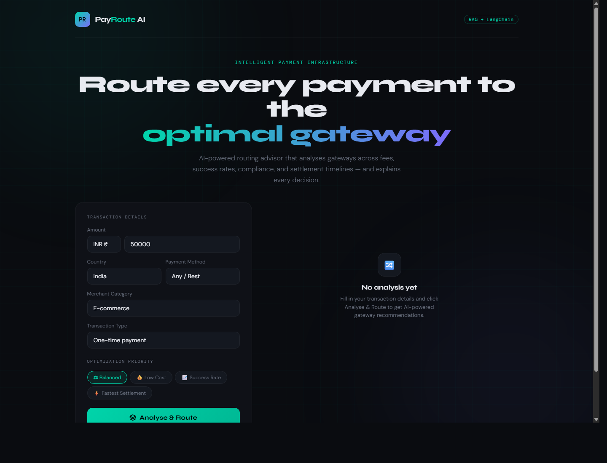

# PayRoute AI 🔀

**Intelligent Payment Gateway Routing Advisor**  
Built with RAG + LangChain + FastAPI + Vanilla JS

**Live Demo:** [https://payroute-ai.vercel.app](https://payroute-ai.vercel.app)



---

## What It Does

PayRoute AI takes a transaction context (amount, country, merchant category, payment method, transaction type) and returns ranked gateway recommendations — each with a score, estimated fee, success rate, settlement timeline, and a natural language explanation powered by Gemini.

### Tech Stack
| Layer | Technology |
|-------|-----------|
| LLM Orchestration | Gemini SDK |
| Knowledge Retrieval | Local markdown context |
| Embeddings | Not required for Vercel deployment |
| LLM | Gemini |
| API | FastAPI + Uvicorn |
| Frontend | Vanilla HTML/CSS/JS (zero deps) |

---

## Project Structure

```
payroute-ai/
├── backend/
│   ├── main.py              # FastAPI app + LangChain RAG logic
│   ├── requirements.txt
│   └── .env.example         # → copy to .env and add API key
├── frontend/
│   └── index.html           # Single-file UI
└── knowledge_base/
    ├── razorpay.md
    ├── stripe.md
    ├── payu.md
    ├── cashfree.md
    └── ccavenue.md
```

---

## Setup

### 1. Install dependencies
```bash
cd backend
pip install -r requirements.txt
```

### 2. Add your Gemini API key
```bash
cp .env.example .env
# Edit .env and add your GOOGLE_API_KEY
```

> **No API key?** The app runs in Demo Mode with rule-based recommendations. Still fully functional for demonstrations.

### 3. Start the backend
```bash
cd backend
uvicorn main:app --reload
# Runs on http://localhost:8000
```

### 4. Open the frontend
```bash
# Just open the file in a browser:
open frontend/index.html
```

## Deploy To Vercel

This repo is now set up to deploy as a single Vercel project:
- `public/index.html` serves the frontend
- `api/index.py` exposes the FastAPI backend as a Vercel Python function
- `knowledge_base/` is loaded by the API at runtime

### 1. Push the project to GitHub
Make sure the repo includes:
- `api/index.py`
- `public/index.html`
- `vercel.json`
- `requirements.txt`

### 2. Import the repo into Vercel
In Vercel:
- Create a new project from your GitHub repo
- Keep the project root as the repository root

### 3. Add environment variables
In the Vercel project settings, add:

```bash
GOOGLE_API_KEY=your-gemini-api-key
GEMINI_MODEL=gemini-2.5-flash
```

### 4. Deploy
Vercel will install dependencies from the root `requirements.txt` and serve:
- `/` -> frontend
- `/api/*` -> FastAPI backend

### 5. Verify
After deploy, open:
- `/`
- `/api/health`

---

## How It Works (RAG Pipeline)

```
User Query
    │
    ▼
LangChain Agent
    │
    ├──► FAISS Vector Store ──► knowledge_base/*.md (5 gateway docs)
    │         (semantic search, top-8 chunks)
    │
    ▼
Gemini (structured prompt)
    │
    ▼
JSON Response: ranked gateways with scores, fees, reasons
    │
    ▼
React-free Frontend renders gateway cards
```

On startup, the backend:
1. Loads all `.md` files from `knowledge_base/`
2. Splits into 800-token chunks with 100-token overlap
3. Embeds all chunks using Gemini embeddings
4. Stores in FAISS (in-memory, fast)

On each `/route` request:
1. Formats the transaction as a structured query
2. Retrieves top-8 most relevant chunks from FAISS
3. Sends chunks + query to Gemini with a structured JSON prompt
4. Parses and returns the recommendation

---

## API Reference

### `POST /route`
```json
{
  "amount": 50000,
  "currency": "INR",
  "country": "India",
  "merchant_category": "E-commerce",
  "payment_method_preference": "upi",
  "transaction_type": "one_time",
  "priority": "balanced"
}
```

**Response:**
```json
{
  "recommendations": [
    {
      "gateway": "Cashfree",
      "score": 9.5,
      "rank": 1,
      "estimated_fee": "0% (UPI zero MDR)",
      "success_rate": "95-98%",
      "settlement_time": "T+1 to same-day",
      "key_reasons": ["..."],
      "warnings": []
    }
  ],
  "summary": "...",
  "transaction_context": { ... },
  "rag_context_used": "..."
}
```

### `GET /health`
Returns vectorstore and chain readiness status.

### `GET /gateways`
Lists all gateways loaded from the knowledge base.

---

## Extending the Project

**Add a new gateway:** Create a new `.md` file in `knowledge_base/` following the same structure. Restart the backend — it will be auto-ingested.

**Swap LLM:** Change `GEMINI_MODEL` in `.env` or the default model in `main.py` to any supported Gemini model.

**Swap vector store:** Replace `FAISS` with `Chroma`, `Pinecone`, or `Weaviate` for persistent storage.

**Add streaming:** Use `streaming=True` on the Gemini chat model instance and FastAPI's `StreamingResponse`.

---

## Interview Talking Points

1. **Why RAG over fine-tuning?** Gateway data changes (new fee structures, new methods) — RAG lets you update the knowledge base without retraining. Fine-tuning would bake stale data into model weights.

2. **Chunk size choice (800 tokens, 100 overlap):** Gateway docs have dense tables. 800 tokens captures a full section (e.g. "Transaction Fees + Success Rates") in one chunk, maintaining context. Overlap prevents information loss at boundaries.

3. **Why FAISS over Pinecone?** For a demo/POC, FAISS runs in-memory with zero infrastructure cost. Production would use a persistent store like Pinecone or Weaviate for updates without restarts.

4. **Structured JSON output:** We prompt the LLM to return strict JSON and parse it. In production, you'd use LangChain's `PydanticOutputParser` or native structured output features for guaranteed schema compliance.

5. **Demo mode:** The fallback rule-based system means the UI is fully demonstrable without spending API credits in a live interview.
