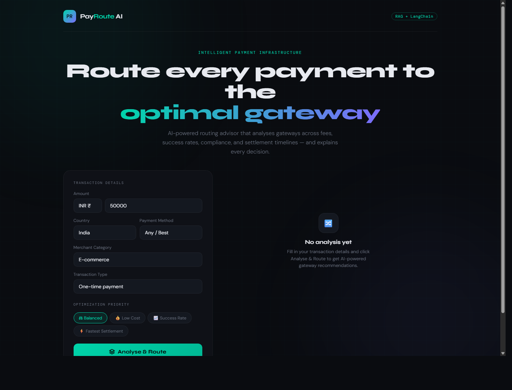

# PayRoute AI 🔀

An intelligent payment gateway routing advisor built with RAG (Retrieval-Augmented Generation), LangChain, FastAPI, and vanilla JavaScript.

**Try it live:** [https://payroute-ai.vercel.app](https://payroute-ai.vercel.app)



---

## What It Does

PayRoute AI helps you choose the right payment gateway for any transaction. Just describe your scenario (amount, country, merchant type, payment method, transaction type), and it ranks available gateways with recommendations, estimated fees, success rates, and reasoning.

Each recommendation includes:
- A confidence score
- Estimated transaction fee
- Expected success rate
- Settlement timeline
- Key reasons for the recommendation
- Any potential warnings

## How It Works

The system uses Retrieval-Augmented Generation (RAG) to stay accurate and current:

1. Your transaction details are sent to the backend
2. A LangChain agent retrieves relevant gateway information from local markdown documents
3. The Gemini LLM processes this information with a structured prompt
4. You get back ranked gateway recommendations as clean JSON

This approach keeps the system grounded in actual gateway data while using AI to make intelligent comparisons.

## Tech Stack

| Layer | Technology |
|-------|-----------|
| LLM Orchestration | Gemini SDK |
| Knowledge Retrieval | Local markdown files |
| Vector Embeddings | FAISS (optional for Vercel) |
| LLM Model | Gemini |
| API Server | FastAPI + Uvicorn |
| Frontend | Vanilla HTML/CSS/JS (no dependencies) |

---

## Project Layout

```
payroute-ai/
├── backend/
│   ├── main.py              # FastAPI app with LangChain RAG
│   ├── requirements.txt
│   └── .env.example         # Copy this to .env and add your API key
├── frontend/
│   └── index.html           # Single-file UI
└── knowledge_base/
    ├── razorpay.md
    ├── stripe.md
    ├── payu.md
    ├── cashfree.md
    └── ccavenue.md
```

---

## Getting Started

### 1. Install dependencies

```bash
cd backend
pip install -r requirements.txt
```

### 2. Add your Gemini API key

```bash
cp .env.example .env
# Edit .env and add your GOOGLE_API_KEY
```

**Note:** If you don't have a Gemini API key, the app still works in Demo Mode with rule-based recommendations. Perfect for testing.

### 3. Start the backend

```bash
cd backend
uvicorn main:app --reload
# Runs on http://localhost:8000
```

### 4. Open the frontend

```bash
open frontend/index.html
```

---

## Deploying to Vercel

The repo is set up for seamless Vercel deployment:

### 1. Push to GitHub

Make sure your repo contains:
- `api/index.py` (FastAPI backend)
- `public/index.html` (frontend)
- `vercel.json`
- `requirements.txt`

### 2. Import into Vercel

- Create a new Vercel project from your GitHub repo
- Keep the project root as the repository root

### 3. Add environment variables

In Vercel project settings:

```bash
GOOGLE_API_KEY=your-gemini-api-key
GEMINI_MODEL=gemini-2.5-flash
```

### 4. Deploy

Vercel handles the rest. It will:
- Install dependencies from `requirements.txt`
- Serve `/` as the frontend
- Serve `/api/*` as the FastAPI backend

### 5. Verify deployment

After deployment, check:
- `https://yourapp.vercel.app` (frontend)
- `https://yourapp.vercel.app/api/health` (backend status)

---

## The RAG Pipeline

Here's how recommendations are generated:

```
Transaction Details
      │
      ▼
LangChain Agent
      │
      ├──► Semantic Search ──► knowledge_base/*.md
      │     (FAISS Vector Store, top-8 chunks)
      │
      ▼
Gemini LLM
(Structured prompt + context)
      │
      ▼
Ranked Gateway Recommendations
(JSON with scores, fees, reasons)
      │
      ▼
Frontend Renders Cards
```

**On startup:** The backend loads all markdown files from `knowledge_base/`, chunks them (800 tokens with 100-token overlap), embeds them, and stores them in FAISS for fast retrieval.

**On each request:** The transaction is formatted as a semantic query, top-8 relevant chunks are retrieved, and Gemini generates structured recommendations.

---

## API Reference

### `POST /route`

Send transaction details and get ranked gateway recommendations.

**Request:**
```json
{
  "amount": 50000,
  "currency": "INR",
  "country": "India",
  "merchant_category": "E-commerce",
  "payment_method_preference": "upi",
  "transaction_type": "one_time",
  "priority": "balanced"
}
```

**Response:**
```json
{
  "recommendations": [
    {
      "gateway": "Cashfree",
      "score": 9.5,
      "rank": 1,
      "estimated_fee": "0% (UPI zero MDR)",
      "success_rate": "95-98%",
      "settlement_time": "T+1 to same-day",
      "key_reasons": [
        "Zero MDR on UPI payments",
        "Excellent success rate",
        "Fast settlement"
      ],
      "warnings": []
    }
  ],
  "summary": "Cashfree is optimal for UPI transactions...",
  "transaction_context": { /* echo of input */ },
  "rag_context_used": "Chunk 1, Chunk 2, ..."
}
```

### `GET /health`

Check if the vectorstore and recommendation chain are ready.

### `GET /gateways`

List all payment gateways currently loaded from the knowledge base.

---

## Design Notes

- **Zero frontend dependencies:** The UI is vanilla JS, HTML, and CSS. No frameworks, no npm installs needed.
- **Flexible backend:** FastAPI makes it easy to extend with new endpoints or modify the LLM logic.
- **Modular knowledge base:** Adding a new gateway is just a new markdown file in `knowledge_base/`.
- **Production-ready on Vercel:** The deployment setup handles API secrets and serverless function limits gracefully.
